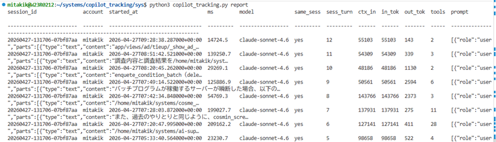
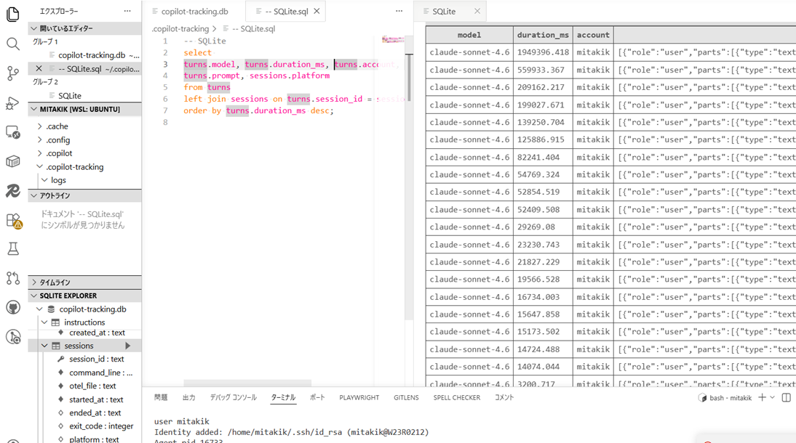

# copilot-tracking

Copilot CLI を起動するときに OpenTelemetry の JSONL を自動で有効化し、終了後に SQLite へ取り込む小さな追跡ツールです。

Node.js や Go の常駐プロセスは不要で、`copilot` をこのラッパー経由で起動するだけで次を記録します。

- プロンプトごとの所要時間
- 各 prompt が同一セッション継続中かどうか
- prompt / response 本文
- user role の instruction / prompt 本文
- account
- model
- input / output / total tokens
- tool call 回数と合計時間
- prompt ごとの context 使用量の近似値 (`context_input_tokens`)

## ファイル

- `copilot_tracking.py`: 収集とレポート本体
- `copilot_tracking_db_monitor.ps1`: Windows 向け軽量ライブモニター
- `copilot-track.sh`: macOS / Linux / WSL2 用ラッパー
- `copilot-track.ps1`: Windows PowerShell 用ラッパー
- `copilot_tracking.ps1`: `copilot-track.ps1` 互換の別名ラッパー
- `sample-web-app`: Python の CLI タスク管理サンプル
- `sample-go-cli-app`: Go の CLI タスク管理サンプル

## 前提

- `copilot` コマンドが使えること
- Python 3 が使えること
- Copilot CLI が OTel monitoring をサポートしていること

`copilot-track.ps1` / `copilot-track.sh` は、起動したシェルの `PATH` から `copilot` を探します。`copilot` が見つからない場合は、そのシェルで Copilot CLI が使える状態にしてから実行してください。

## すぐ使う

### macOS / Linux / WSL2

```bash
cd /path/to/copilot-tracking
chmod +x ./copilot-track.sh
./copilot-track.sh
```

### Windows PowerShell

```powershell
Set-Location C:\path\to\copilot-tracking
.\copilot-track.ps1
# または
.\copilot_tracking.ps1
```

このラッパーは内部で次を設定してから `copilot` を起動します。

- `COPILOT_OTEL_ENABLED=true`
- `COPILOT_OTEL_FILE_EXPORTER_PATH=<session jsonl>`
- `COPILOT_OTEL_EXPORTER_TYPE=file`
- `OTEL_INSTRUMENTATION_GENAI_CAPTURE_MESSAGE_CONTENT=true`

終了時に JSONL を SQLite に取り込みます。

## 保存先

既定ではホームディレクトリ配下に保存します。

- DB: `~/.copilot-tracking/copilot-tracking.db`
- 一時 JSONL: `~/.copilot-tracking/logs/`

Windows では概ね次です。

- DB: `%USERPROFILE%\.copilot-tracking\copilot-tracking.db`

## レポートを見る

### 直近の結果だけを見る

```bash
python3 copilot_tracking.py recent
python3 copilot_tracking.py recent 5
python3 copilot_tracking.py recent --live
python3 copilot_tracking.py recent --live 5
```

```powershell
python .\copilot_tracking.py recent
python .\copilot_tracking.py recent 5
python .\copilot_tracking.py recent --live
python .\copilot_tracking.py recent --live 5
```

`recent` は直近 1 件の prompt / response を見やすく表示します。  
件数を付けると直近 n 件を新しい順に確認できます。

各行には `same_sess` (その prompt が同一 CLI セッションの継続か), `sess_turn` (そのセッション内で何件目か), `ctx_in` (context 使用量の近似値) も表示します。

セッション終了前の確認には `--live` を使います。  
これは SQLite ではなく `logs` 配下の最新 JSONL を直接読むので、進行中セッションの直近完了ターンも確認できます。

### Windows で軽くライブ監視する

```powershell
.\copilot_tracking_db_monitor.ps1
.\copilot_tracking_db_monitor.ps1 -Once -Tail 3
.\copilot_tracking_db_monitor.ps1 -OtelFile "$env:USERPROFILE\.copilot-tracking\logs\20260425-213000-abcd1234.jsonl"
```

このスクリプトは Python や SQLite を起動せず、最新の OTel JSONL をそのまま監視します。  
進行中セッションの完了ターンを軽く追いたいときは `copilot_tracking.py recent --live` よりこちらが向いています。

### 直近の prompt 一覧

```bash
python3 copilot_tracking.py report
python3 copilot_tracking.py report 3
python3 copilot_tracking.py report --live
python3 copilot_tracking.py report --live 3
```

```powershell
py -3 .\copilot_tracking.py report
python .\copilot_tracking.py report 3
python .\copilot_tracking.py report --live
python .\copilot_tracking.py report --live 3
```

  

`report --live` を使うと、進行中セッションの最新 JSONL を `report` 形式の一覧で確認できます。  
一覧には account に加えて `same_sess` / `sess_turn` / `ctx_in` 列も表示されます。

### セッション一覧

```bash
python3 copilot_tracking.py sessions
```

セッション一覧にも account 列を表示します。

### 記録内容を全て消去

```bash
python3 copilot_tracking.py clear --yes
```

```powershell
py -3 .\copilot_tracking.py clear --yes
```

これで SQLite DB と、残っている OTel JSONL をまとめて削除します。

## エイリアス化して「copilot」で使う

### bash / zsh

```bash
alias copilot="$PWD/copilot-track.sh"
```

### PowerShell

```powershell
function copilot { & "C:\path\to\copilot-tracking\copilot-track.ps1" @args }
```

これで普段どおり `copilot` と打つだけで記録されます。


## 特定プロジェクトの設定を読み込んだ状態で本ツールを起動する

プロジェクト固有の指示ファイル（`CLAUDE.md` など）を読み込ませつつトラッキングを有効にしたい場合は、`-C` オプションで作業ディレクトリを指定します。

```bash
python3 /path/to/copilot_tracking.py wrap -C /path/to/your-project
```

シェルスクリプトを使う場合は、起動前にプロジェクトディレクトリへ移動します。

```bash
cd /path/to/your-project
/path/to/copilot-track.sh
```

`CLAUDE.md` などはセッション開始時のカレントディレクトリから読み込まれます。セッション開始後に `/cwd` コマンドで移動した場合も読み込まれますが、**起動時から正しいディレクトリを指定するのが確実**です。

例）
BoReborn/migration_agent固有のskillなどを読み込ませつつ、copilot-trackingツールを利用する例です
```bash
mitakik@W23R0212:~/systems/BoReborn/migration_agent$ /home/mitakik/systems/copilot_tracking/src/copilot-track.sh
```


## 主なコマンド

### 追跡付きで起動

```bash
python3 copilot_tracking.py wrap
python3 copilot_tracking.py wrap -C ../workflow-tracking -p "workflow-trackingのMCPサーバーを作る" --allow-all-tools
python3 copilot_tracking.py wrap -p "workflow-trackingのMCPサーバーを作る" --allow-all-tools
python3 copilot_tracking.py wrap -- --help
python3 copilot_tracking.py wrap --wrapper-help
```

`wrap` は追跡用オプション (`--db`, `--logs-dir`, `-C/--cwd`, `--keep-otel-file`, `--no-capture-content`) を先頭だけ解釈し、最初の未知の引数以降はそのまま `copilot` に渡します。  
そのため、普段どおり `-p` や `--allow-all-tools` をそのまま書けます。

#### 別ディレクトリを調査し、出力は別の場所に限定したい場合

調査対象ディレクトリを `A`、成果物の出力先を `B` にしたい場合は、`-C/--cwd` で作業ディレクトリを `B` にし、`A` は `--add-dir` で参照対象として追加する使い方が安全です。

```powershell
python .\copilot_tracking.py wrap `
  -C C:\path\to\output-B `
  -p "C:\path\to\source-A を調査してください。source-A 配下は参照専用です。source-A 内の既存ファイルの作成・編集・削除は一切しないでください。成果物は C:\path\to\output-B 配下にのみ出力してください。" `
  --add-dir C:\path\to\source-A `
  --allow-all-tools
```

プロンプトでは少なくとも次を明示してください。

- `A を調査対象にする`
- `A 配下の既存ファイルは 1 つも変更しない`
- `成果物は B 配下にのみ保存する`
- `A 以外は調査しない`

特に重要なのは、`A` を `cwd` にしないことです。`cwd=B` にして `--add-dir A` を使うと、A を読み取り対象、B を出力先として分けやすくなります。  
ただし、プロンプトだけでは絶対保証にはならないため、A 配下を確実に保護したい場合は NTFS ACL などで読み取り専用にしてください。

### 既存 JSONL の手動取り込み

```bash
python3 copilot_tracking.py ingest \
  --otel-file ~/.copilot-tracking/logs/example.jsonl \
  --session-id manual-import-001
```


## 補足

- `same_sess=yes` は、その prompt より前に同じ `session_id` の turn が既にあることを表します。`session_id` は 1 回の `wrap` 実行単位です。
- `context` の厳密な UI 表示値そのものではなく、OTel から取れる `context_input_tokens` を優先し、取れない場合は `input_tokens` を近似値として表示します。
- OTel の属性名は CLI バージョン差分があり得るので、このスクリプトは代表的な GenAI attribute 名を優先しつつ、複数候補を見にいくようにしてあります。
- Copilot CLI の OTel に account が含まれないバージョンでは、`gh api user --jq .login` のアクティブアカウントを fallback として保存します。`gh` が未認証・対話待ち・ネットワーク待ちでも本処理を止めないよう、この fallback は短い timeout 付きの best-effort で実行します。
- 既存の SQLite に `account` 列が足りない、または過去データの account が空の場合は、起動時に自動でマイグレーションし、保存済み `raw_json` / 残っている OTel JSONL から補完できる範囲で復元します。
- OTel JSONL は CLI バージョンにより `resourceSpans` 形式と 1 行 1 span 形式の両方があるため、このスクリプトはどちらも取り込めます。
- prompt / response を保存するため、ログと DB に機密情報が残る可能性があります。必要なら `--no-capture-content` を使ってください。
- 記録された SQLite DB は、VSCode の [SQLite Viewer](https://marketplace.visualstudio.com/items?itemName=qwtel.sqlite-viewer) などのプラグインを使って任意に参照・抽出することを想定しています。

  